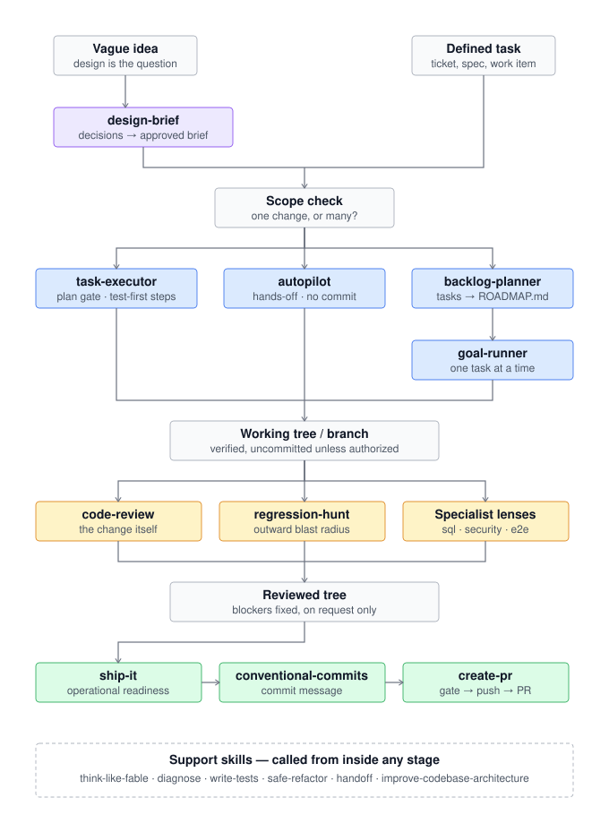
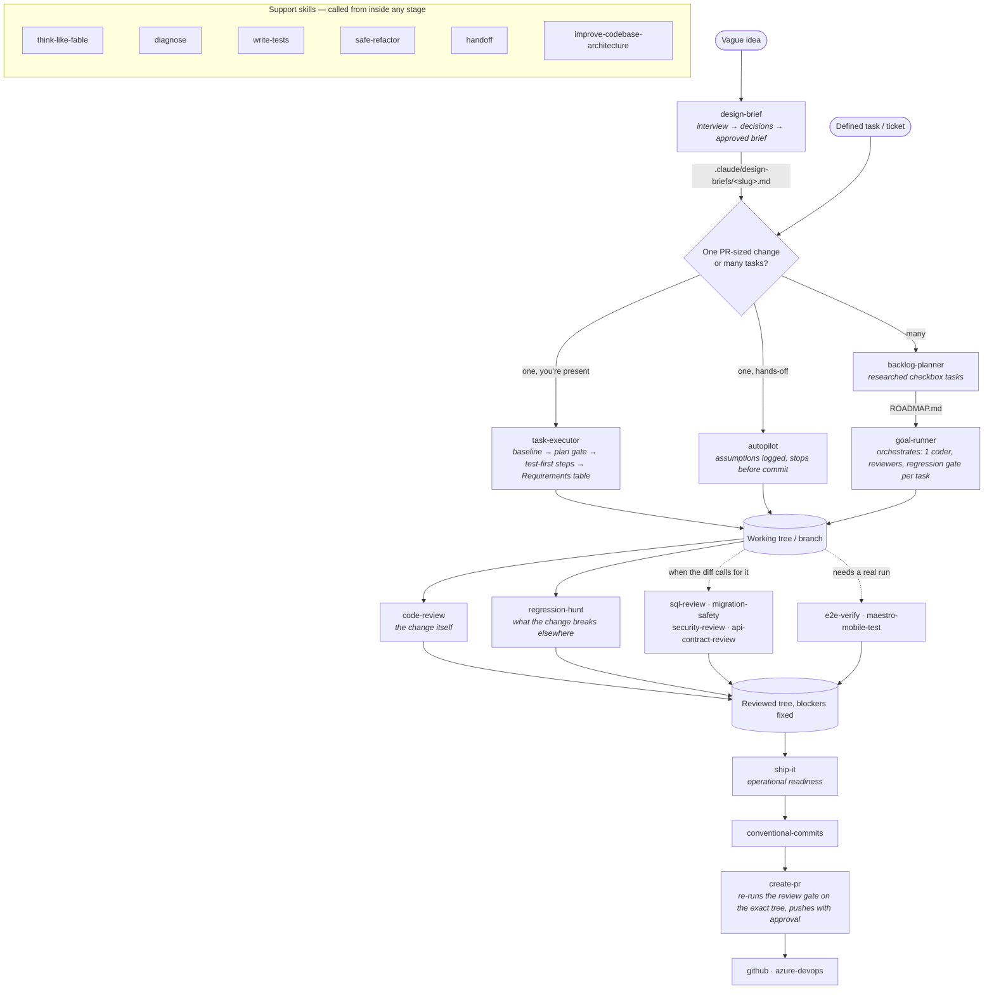

# claude-skills

The [Claude Code](https://docs.claude.com/en/docs/claude-code/overview) skills I ([Dennis Rongo](https://github.com/dennisrongo)) use every day — not shelfware, not theory. Each one earns its place by surviving real work: shipping features, reviewing PRs, debugging production, designing architecture, and keeping commits clean.

They're small, composable, and meant to be tuned. Install the ones you want, edit them in-place, send a PR if yours sharpens mine. The library is self-contained: no skill depends on anything outside this repo's `skills/` directory. See [How the skills fit together](#how-the-skills-fit-together) for the idea-to-PR flow.

> Skills are reusable bundles of instructions that Claude consults when relevant. This repo is my personal daily-driver library — grow it over time, tune the ones that misfire, install the set you want on any machine.

## Quick start

### From npm (recommended)

The package is published as [`@dennisrongo/skills`](https://www.npmjs.com/package/@dennisrongo/skills). The installed binary is `skills`.

```bash
# See what's in the library
npx @dennisrongo/skills list

# Interactive picker, global (~/.claude/skills)
npx @dennisrongo/skills install

# Interactive picker, project-scoped (./.claude/skills)
npx @dennisrongo/skills install -p

# Install specific skills globally (~/.claude/skills)
npx @dennisrongo/skills install conventional-commits code-review

# Install specific skills into the current project
npx @dennisrongo/skills install conventional-commits code-review -p

# Install everything into the current project (./.claude/skills)
npx @dennisrongo/skills install --all --project
```

Or install once and call it directly:

```bash
npm install -g @dennisrongo/skills
skills list
```

### From GitHub (for the latest `main`)

Useful if you want changes that haven't been released to npm yet.

```bash
npx github:dennisrongo/claude-skills list
npx github:dennisrongo/claude-skills install
```

> The interactive picker, `--all`, and named-skill installs all accept `-p` / `--project` to target `./.claude/skills` instead of the global `~/.claude/skills`. Run it from the project root.

### Shorter alias (recommended)

`npx github:dennisrongo/claude-skills` is a mouthful. Add a shell alias:

```bash
# bash / zsh — add to ~/.bashrc or ~/.zshrc
alias skills="npx --yes github:dennisrongo/claude-skills"

# fish — add to ~/.config/fish/config.fish
alias skills "npx --yes github:dennisrongo/claude-skills"
```

Then:

```bash
skills list
skills install --all
```

### From ClawHub (any MCP-capable agent — OpenClaw, Hermes, etc.)

Every skill is published to [ClawHub](https://clawhub.ai/dennisrongo) under `@dennisrongo/<skill-name>` with commit provenance linked back to this repo. ClawHub is the cross-agent registry — if your agent installs skills from it, you don't need this repo or npm at all.

```bash
# OpenClaw
openclaw skills install @dennisrongo/code-review
openclaw skills install @dennisrongo/diagnose

# Hermes Agent
hermes skills install clawhub/dennisrongo/code-review

# The whole catalog
openclaw skills search dennisrongo
```

```bash
# Same skills, straight from this repo (Claude Code's native skill dirs):
npx @dennisrongo/skills install code-review diagnose
# or pin a copy:
git clone https://github.com/dennisrongo/claude-skills.git
cp -r claude-skills/skills/diagnose ~/.claude/skills/
```

> Skills are plain `SKILL.md` folders — agent-agnostic by design. The npm package targets Claude Code's skill directories (`~/.claude/skills`, `./.claude/skills`) specifically; ClawHub puts the same content within reach of every registry-aware agent.

### Pinning a version

`npx github:...` resolves to the latest commit on `main`. To pin to a specific commit, branch, or tag:

```bash
npx github:dennisrongo/claude-skills#v0.1.0 install      # tag
npx github:dennisrongo/claude-skills#abc1234 install     # commit SHA
npx github:dennisrongo/claude-skills#some-branch install # branch
```

### Local clone (for contributors)

```bash
git clone https://github.com/dennisrongo/claude-skills.git
cd claude-skills
npm install
node bin/claude-skills.js list
```

## Available skills

| Skill | What it does |
|---|---|
| [`api-contract-review`](./skills/api-contract-review/SKILL.md) | Review an API's contract as a **promise to consumers you can't see** — HTTP endpoints, webhooks, published events, SDK-facing types. Two evidence rules do the work: a **breaking** verdict requires a before/after diff of a consumer-visible element (`git show` the old DTO/spec vs. the working tree — removed/renamed fields, type changes, requiredness tightened on requests, status-code or enum semantics changed under the same name), and an **inconsistency** finding requires citing the in-repo precedent being violated (error envelope, naming, pagination style, auth placement — grep the siblings first or don't flag it). Also checks the day-one invariants that can't be retrofitted: collections paginate from the start, retryable writes are idempotent, errors carry a machine-usable `code`, no ORM entities serialized wholesale, timestamps/money carry explicit units. Reports **Breaking / Design / Questions**, ranked — zero findings is a valid outcome. Distinct from [`code-review`](./skills/code-review/SKILL.md) (implementation quality): this reviews the *surface*. Triggers on "review this API", "is this a breaking change", "check backward compatibility", "review the contract", or `/api-contract-review`. |
| [`autopilot`](./skills/autopilot/SKILL.md) | Fully autonomous end-to-end run of **one** defined task with **no human gates** — a work item (pulled via [`azure-devops`](./skills/azure-devops/SKILL.md) or [`github`](./skills/github/SKILL.md), chosen by the git remote, **including embedded screenshots**) or an inline description becomes a verified working tree plus an evidence-backed report, and every question it would have asked becomes an ASSUMPTIONS row (question → choice → why with `file:line` → blast radius). Consumes an `APPROVED` [`design-brief`](./skills/design-brief/SKILL.md) as the spec when one matches; an *architectural* task is a hard stop with the brief named as the route back. **Puts every applicable skill in the library to work on observable predicates**, via a routing table with a probe and a fallback per row: [`task-executor`](./skills/task-executor/SKILL.md)'s inspection discipline and [`think-like-fable`](./skills/think-like-fable/SKILL.md)'s self-grill replace the plan gate; stack skills ([`dotnet-onion-api`](./skills/dotnet-onion-api/SKILL.md), [`nextjs-app-router`](./skills/nextjs-app-router/SKILL.md), [`tauri-2-app`](./skills/tauri-2-app/SKILL.md)) supply conventions when their files are present; each behavior increment opens red under [`write-tests`](./skills/write-tests/SKILL.md); a failure the error text can't explain goes to [`diagnose`](./skills/diagnose/SKILL.md); [`code-review`](./skills/code-review/SKILL.md) always runs with blocker-fix authority, joined by [`regression-hunt`](./skills/regression-hunt/SKILL.md), [`security-review`](./skills/security-review/SKILL.md), [`sql-review`](./skills/sql-review/SKILL.md), [`migration-safety`](./skills/migration-safety/SKILL.md), [`api-contract-review`](./skills/api-contract-review/SKILL.md), [`ship-it`](./skills/ship-it/SKILL.md), [`e2e-verify`](./skills/e2e-verify/SKILL.md), and [`maestro-mobile-test`](./skills/maestro-mobile-test/SKILL.md) when the diff trips their predicate. A present skill is mandatory — "the diff felt small" never skips one — and the report's **Skills used** table proves which ran. Baselines the suite before the first edit, never implements on the default branch, one named fix and one retry per failure, **three failed fixes on one behavior is a hard stop** with the tree reverted to the last observed green. **Stops dead before any commit/push/PR.** The report is a fixed template: Outcome, a **Requirements table** (each criterion quoted with its observed evidence, met / gap / deviation), what changed, tagged evidence (`verified` / `inferred` / `assumed`), review outcome, skills used, assumptions, found-along-the-way, and a paste-ready [`conventional-commits`](./skills/conventional-commits/SKILL.md) block naming [`create-pr`](./skills/create-pr/SKILL.md) as your next step — gated by a delivery checklist before it is handed back. Sub-agents route by role from [`model-inventory`](./skills/model-inventory/SKILL.md) chains. Launch headless: `claude -p "autopilot task 123" --permission-mode acceptEdits`. Triggers on "autopilot task <id>", "run this autonomously", "work this end to end without asking", or `/autopilot`. |
| [`azure-devops`](./skills/azure-devops/SKILL.md) | Work with any Azure DevOps org via the az CLI, fully **config-driven** — org, project, target branch, and required-reviewer GUIDs live in `.claude/azure-devops.json` (the skill offers to create it on first use; nothing org-specific is hardcoded). Queries assigned/sprint work items with WIQL, reads a work item's description **and downloads + views its embedded screenshots** (acceptance criteria hide in images), publishes branches only with approval, and creates PRs with house defaults — one PR per repo, required reviewers with a GUID PUT fallback when email resolution fails, auto-complete, work item linked — then **verifies every setting after creation**. Ships the battle-tested az.cmd sharp edges: JMESPath quoting through the batch wrapper, plain-float `--api-version`, stderr-polluted JSON parsing, PAT scope-gap diagnosis. Triggers on "pull my tasks", "read task 12345", "az boards", "az repos" — PR creation routes through [`create-pr`](./skills/create-pr/SKILL.md), which uses this skill as its Azure DevOps backend. |
| [`backlog-planner`](./skills/backlog-planner/SKILL.md) | The **intake side** of [`goal-runner`](./skills/goal-runner/SKILL.md) — turn a feature idea, conversation, rough notes, or an `APPROVED` brief from [`design-brief`](./skills/design-brief/SKILL.md) into researched, dependency-ordered checkbox tasks appended to the project's roadmap file, in exactly the format `goal-runner` and `/goal` consume unattended. **Scope check first**: material spanning independent subsystems is split into one section per subsystem, each shippable alone, and the first is planned fully before the rest. **Research is most of the work**: every file/module/endpoint a task names is a claim that gets grepped or opened (or rewritten as a locate-first spike), scouting scales from inline reads to parallel `Explore` sub-agents, the riskiest unknown is front-loaded, and [`think-like-fable`](./skills/think-like-fable/SKILL.md) rigor applies when installed. Each task passes the **fresh-session test** — one `- [ ]` line carrying what + done-when, plain sub-bullets for verified entry points, acceptance criteria, the verification command, and labeled `Assumes:` lines (never nested checkboxes — those become phantom queue items). **Interfaces between tasks are written down**: `Produces:` on the task that creates a function/type/endpoint, `Consumes:` verbatim on the task that uses it; project-wide rules go once in a **global-constraints block** the coordinator copies into every coder brief. Before appending, three scans: **coverage** (every requirement → a task, every task → a requirement), **placeholders** (no "TBD", "handle edge cases", "similar to task N"), and **name consistency** across tasks. Appends without reordering or ticking anything; when no roadmap exists, asks once and defaults to `ROADMAP.md`. Two detailed tasks is a valid outcome. Triggers on "add this to the backlog", "add it to the roadmap", "plan these tasks", "break this down into tasks", or `/backlog-planner`. |
| [`code-review`](./skills/code-review/SKILL.md) | Production-readiness review at either scope — **uncommitted working-tree changes** (the default) or a **committed branch grouped per `#NNN` task** from commit messages (per-task lens council, `unscoped` bucket for unreferenced commits — see `references/branch-review.md`). **Read-only on git state** while reviewing: `status`/`diff`/`show`/`log` only, a throwaway worktree for another revision, never `checkout`/`stash`/`reset` on the user's checkout. Hunts DRY violations, dead code, leaky and premature abstractions, magic values, missing error handling, debug residue, missing migrations / flags / logs — prioritized correctness → DRY/design → tests → security → performance → production-readiness → readability — and treats **intent alignment as a finding class**: the diff is checked line by line against the ticket, brief, or plan, deviations are named so the author can confirm them, and a requirement that lives in *unchanged* code is reported as `question: cannot verify from diff`, never silently passed. On non-trivial diffs, convenes a **lens council**: parallel `Explore` sub-agents (correctness / design / security / tests / production-readiness), briefed **without pre-judgment** (no "don't flag X"), followed by an **adversarial critique round** that challenges every blocker against the surrounding code. Auto-detects and runs the project's tests and build and gates the verdict on them. **Never edits code unprompted** — categorized report (`blocking` / `suggestion` / `question` / `nit` / `praise`) with `file:line` citations, zero findings a valid outcome, then asks per-finding before fixing. **Acting on findings** — yours, a sub-agent's, a CI bot's, or a human reviewer's — is its own protocol: read all before touching any, verify each against the codebase, push back with reasoning when one is wrong, implement blocking → simple → complex one at a time with a validation each, no performative agreement. Composes with [`regression-hunt`](./skills/regression-hunt/SKILL.md) for what the change breaks elsewhere. Triggers on "code review", "review the diff", "review my PR", "review my branch", "is this production ready", "DRY check", or `/code-review`. |
| [`codebase-explainer`](./skills/codebase-explainer/SKILL.md) | Produce a durable onboarding artifact for a repo — writes `ONBOARDING.md` (or `docs/ONBOARDING.md` if `docs/` exists) with a tight **read this first** minimum, system overview, dependency map (top-level prod deps + how each is actually used in *this* codebase, with key call site), startup flow (entry point → bootstrap → config), auth flow (or an explicit "no auth detected" when there isn't one), and the 5–15 important files — every claim backed by a `file:line` citation. Walks the repo with **parallel Explore sub-agents** to stay context-safe on big projects, refreshes an existing `ONBOARDING.md` in place instead of rewriting from scratch, and is opinionated about what *not* to include (no dev/test/types deps, no 40-file "important files" lists, no fabricated auth flows, no dates that rot). Built for revisiting a project after months away — and for new teammates landing in an unfamiliar repo. Composes with [`improve-codebase-architecture`](./skills/improve-codebase-architecture/SKILL.md) when shallow-module clusters surface and [`handoff`](./skills/handoff/SKILL.md) for session-level state. Triggers on "explain this codebase", "onboard me", "give me a tour", "where do I start", "I haven't looked at this in months", or `/codebase-explainer`. |
| [`conventional-commits`](./skills/conventional-commits/SKILL.md) | Write git commit messages that follow the [Conventional Commits](https://www.conventionalcommits.org/) spec (`feat`, `fix`, `chore`, `docs`, …), auto-prefixed with the ticket number from the current branch (e.g. `feature/12345-...` → `#12345`) and a project tag (`API` / `CLIENT` / `CONSOLE` / `DB`) when detectable from the diff. Both prefixes are omitted when they don't apply; `CONSOLE` means .NET console/worker apps, and a tie between project buckets is asked, not guessed. The type comes from the diff actually read, not the user's phrasing; unrelated staged changes are flagged with a suggestion to split rather than folded into `chore: various updates`; breaking changes get `!` plus a `BREAKING CHANGE:` footer; descriptions stay lowercase, under 72 characters, no trailing period. Triggers on "write a commit message", "help me commit", `git commit`, or changelog-entry requests. |
| [`create-pr`](./skills/create-pr/SKILL.md) | End-to-end pull-request flow with the review gate **before** publishing: runs [`code-review`](./skills/code-review/SKILL.md) in branch scope (plus [`sql-review`](./skills/sql-review/SKILL.md) when SQL changed, plus [`regression-hunt`](./skills/regression-hunt/SKILL.md) when the branch renames a symbol, changes a default or signature, or touches shared state — a confirmed regression is blocking); blocking findings are fixed or explicitly waived with the waiver recorded in the PR body. **Green on the exact tree you publish** — anything that changes after the gate (blocker fix, squash, rebase) means re-run and quote the summary line before pushing. **Confirms the base branch** against what the branch actually forked from (`git merge-base`, upstream, or the work item) and asks on mismatch rather than opening a PR that reviews someone else's commits. Pushes only with approval, **never force-pushes on its own initiative** (a rejected push means fetch and investigate), creates **one PR per repo per work item** with configured house defaults, cross-references sibling PRs with deploy-order coupling stated (DB → API → client), and **re-reads each PR after creation** to confirm reviewers/links/auto-complete actually stuck. Detects the provider from the git remote: Azure DevOps → [`azure-devops`](./skills/azure-devops/SKILL.md), GitHub → [`github`](./skills/github/SKILL.md). Triggers on "create a PR", "publish the branch and create a PR", "ship this branch", or `/create-pr`. |
| [`design-brief`](./skills/design-brief/SKILL.md) | Turn a vague feature idea into an **approved design brief** — `.claude/design-briefs/<slug>.md` recording the intent, every decision with its *why* and cost-if-wrong, scope in/out, exact interfaces (`Produces:`/`Consumes:` lines ready for [`backlog-planner`](./skills/backlog-planner/SKILL.md)), constraints, and the precedent slice it follows. Reads the code before asking, then interviews with **forking questions only** (a question earns its slot only if different answers lead to different designs), and when a genuine design fork survives the precedent check runs **Design It Twice** — two parallel sub-agents each defending one side, a 3/3 debate, one recommendation, the loser recorded as the considered alternative. Produces decisions, never code; [`task-executor`](./skills/task-executor/SKILL.md) and [`autopilot`](./skills/autopilot/SKILL.md) consume the approved brief as their spec, and a brief-less "this is just a bounded task" verdict is a valid outcome. |
| [`diagnose`](./skills/diagnose/SKILL.md) | Disciplined diagnosis loop for hard bugs and performance regressions — reproduce → minimise → hypothesise → instrument → fix → regression-test — with a fast, deterministic feedback loop before any guessing. The user's own diagnosis is hypothesis #1, not the conclusion. Before theorising, **compares against a working sibling** (the nearest thing that works, read completely, every difference listed — each one a ready-made hypothesis), and on multi-layer paths **bisects by boundary first** (log what enters and exits each layer in one run, find the first divergence, exonerate the rest by evidence). On non-trivial cases, Phase 3 convenes a **hypothesis council**: parallel `Explore` sub-agents, one per candidate, each defending its case with falsifiable predictions and `file:line` evidence, then a cross-examination round drops the unsupported and ranks the survivors; trivial bugs use 1–2 inline hypotheses. Library-API hypotheses check current docs (`context7`) before instrumenting; perf regressions measure before they fix. Tagged `[DEBUG-...]` instrumentation cleans up with one grep. The accepted hypothesis must explain **every** symptom; the fix is **one change scoped to the cause**, no bundled refactoring, regression test written first where a correct seam exists. **Three failed fixes is a wrong architecture, not a fourth attempt** — stop and hand off to [`improve-codebase-architecture`](./skills/improve-codebase-architecture/SKILL.md). Several independent failures at once → one sub-agent per domain, in parallel. Ends with a post-mortem naming what would have prevented the bug — defense in depth at the boundary the bad value entered, condition-based waiting in place of sleeps. Triggers on "diagnose this" / "debug this" / bug reports / flaky tests / perf regressions. |
| [`dotnet-onion-api`](./skills/dotnet-onion-api/SKILL.md) | Scaffold a new .NET solution (Web API + Worker microservices) using ONION architecture and EF Core, codifying battle-tested layered patterns and explicitly removing common legacy pitfalls (sproc-centric repos with reflection, EF6 on netstandard2.1, polling console workers, mutable base-service state, missing `CancellationToken`). Three modes — full solution scaffold, add-a-feature slice, add-a-worker microservice. Resolves TFM and NuGet versions at scaffold time (not hard-coded). |
| [`e2e-verify`](./skills/e2e-verify/SKILL.md) | Verify a change end-to-end in a real browser, routed by one question: **who needs this check to run again?** Nobody → **ephemeral**: run [Expect](https://github.com/millionco/expect) (explicit non-prod `--url`, `--no-cookies` by default) or [browser-use](https://github.com/browser-use/browser-use) (an AI agent driving headless Chromium — bundled setup scripts + engine guide in `references/browser-use.md`) if installed, or have Claude drive the browser directly — walking the flows the *diff* touches, verifying via DOM/accessibility state, and checking the console + network log after each flow (a page that looks right while logging exceptions is a finding). CI-forever (money/auth/signup/checkout/deletion) → **durable**: Playwright tests committed to the repo under [`write-tests`](./skills/write-tests/SKILL.md) discipline — extend the repo's existing e2e setup, `getByRole`/`getByTestId` selectors never CSS chains, no sleeps, API-seeded independent tests, every test **proven red-capable** with both runs quoted. The evidence rule that holds across every engine: an AI-walked flow yields *"no issues found in the paths walked"* with paths enumerated and observations quoted — never "e2e passes"; unobserved behavior is "not verified", never "works". Hard gate: no production targets, no real user cookies. Triggers on "verify this in the browser", "test it end to end", "e2e test this", "write playwright tests", "run expect", "smoke test the UI", or `/e2e-verify`. |
| [`github`](./skills/github/SKILL.md) | The gh-CLI twin of [`azure-devops`](./skills/azure-devops/SKILL.md) — fully config-driven (`.claude/github.json`: reviewers, target branch, title pattern, link keyword, auto-merge strategy; offered on first use). Queries assigned issues (`gh issue list`, cross-repo `gh search`, milestones as the sprint equivalent, Projects v2 boards), reads an issue's body **and comments** — acceptance criteria hide there — **and downloads embedded screenshots with the auth token** (private-repo attachments serve a login page to anonymous curl), publishes branches with approval, and creates PRs with reviewers, auto-merge (`gh pr merge --auto`), and the issue linked via a configurable closing keyword (`Closes` vs `Refs`, so merges don't silently close issues that should stay open). Knows the sharp edges: sibling PRs cross-referenced as `owner/repo#N` (bare `#N` resolves to the wrong item across repos), `--json` everywhere instead of parsing human output, and the honest answer on "required reviewers" (that's branch-protection/CODEOWNERS territory, not a PR flag). Triggers on "pull my issues", "read issue 123", "enable auto-merge" — PR creation routes through [`create-pr`](./skills/create-pr/SKILL.md), which uses this skill as its GitHub backend. |
| [`goal-runner`](./skills/goal-runner/SKILL.md) | Autonomous roadmap loop — pairs with the built-in `/goal` Stop hook to work a task file (ROADMAP.md or any checkbox list) **one task at a time until it's done**. The main agent **orchestrates only**, driving each task with a distilled coordinator doctrine: risk-scaled fan-out (0–3 parallel scouts, exactly **one** coder as sole writer to the tree, review lenses in parallel), riskiest-unknown-first scouting, sub-agent reports treated as **testimony, not truth**, and its own context guarded by handing artifacts over as **files, not pasted text** (briefs, coder reports, and `BASE..HEAD` diffs under `.claude/goal-runner/<run>/`, kept out of commits). A **run ledger** (`progress.md`: task started with its BASE sha, fix rounds, complete with evidence, BLOCKED with reason, and every `Ruling:` with its cost-if-wrong) makes the loop survive compaction and `handoff` — a resumed session trusts the ledger and `git log` over memory, so finished tasks are never re-dispatched. Phase 0 baselines the suite, confirms git posture, resolves sub-agent models per role from [`model-inventory`](./skills/model-inventory/SKILL.md) chains, and **pre-flights the queue for conflicts** (same file or interface touched twice, `Produces:` vs `Consumes:` mismatches, contradictions with the global-constraints block) — ruling on each before task 1. Every sub-agent prompt is composed from bundled briefs (`references/agent-briefs.md`): coders return a fixed status line (`DONE` / `DONE_WITH_CONCERNS` / `NEEDS_CONTEXT` / `BLOCKED`), never spawn their own reviewer, and test first where a seam exists; reviewers get the exact `BASE..HEAD` diff, plan alignment as a lens item, `⚠️ cannot verify from diff` for cross-task requirements, and **never a pre-judged brief** ("don't flag X") — the coordinator adjudicates every finding and ledgers the ruling. Review via [`code-review`](./skills/code-review/SKILL.md) (blockers → fixer, max two cycles), [`regression-hunt`](./skills/regression-hunt/SKILL.md) when a task touches shared code, regression gate = no new failures vs. the baseline. A task closes only on observed evidence; **no commits or pushes unless the goal text grants them** (then one commit per task, never red); blocked tasks are annotated `BLOCKED: <reason>` and skipped, never faked. The final report lists every ruling made on the human's behalf. Triggers on "work on the roadmap tasks til completion", "work the roadmap", "use sub agents to work tasks until completion", or `/goal-runner`. |
| [`handoff`](./skills/handoff/SKILL.md) | Capture a session hand-off before context runs out — writes a dated `.claude/handoffs/*.md` (objective, progress, decisions, files, open issues, ready-to-paste next-session prompt) plus a lightweight memory pointer so a fresh Claude session can resume cleanly. |
| [`humanizer`](./skills/humanizer/SKILL.md) | Rewrite prose so it does not read like an LLM wrote it. Strips known AI-writing tells (significance inflation, "delve"/"tapestry" vocabulary, rule-of-three lists, em-dash sales rhythm, sycophancy, hedge filler) **without inventing facts** and **without putting a narrator into engineering prose**. Opens with a **genre gate** (engineering vs. essay) before touching a word, treats tells as clusters rather than isolated words (zero findings is valid), and calibrates voice only from a sample given in the same turn. Four modes — review-only (lists hits and stops), embedded text, a file rewritten in place, and long-form pasted prose — with a repo-wide sweep run as File mode one file at a time. Opt-in only — does not rewrite your own reviews or commit messages unless asked. Derivative of [blader/humanizer](https://github.com/blader/humanizer) (MIT, Siqi Chen) plus Wikipedia's Signs of AI writing; third-party notices live in the skill's [`LICENSE`](./skills/humanizer/LICENSE). Triggers on "humanize", "de-AI", "de-slop", "un-ChatGPT", "review this for AI tells", or `/humanizer`. |
| [`improve-codebase-architecture`](./skills/improve-codebase-architecture/SKILL.md) | Surface architectural friction and propose **deepening opportunities** — refactors that collapse clusters of shallow modules into one deep module with a real seam. Walks the codebase with an Explore sub-agent, applies the **deletion test** to suspected pass-throughs, presents numbered candidates (files / problem / solution / benefits) using `CONTEXT.md` for the domain and a strict architecture glossary (module / interface / seam / depth / leverage / locality) for the structure, then drops into a grilling loop with optional parallel sub-agent interface design ("Design It Twice"). Updates `CONTEXT.md` inline as new concepts get named and offers an ADR only when a rejection is load-bearing. Writes no production code. Triggers on "improve architecture", "architecture review", "find refactoring / deepening opportunities", "find shallow modules", "make this more testable", or `/improve-codebase-architecture`. |
| [`maestro-mobile-test`](./skills/maestro-mobile-test/SKILL.md) | Write and run E2E tests for React Native / Expo apps using [Maestro](https://github.com/mobile-dev-inc/maestro) CLI — the open-source tool that drives the **real native app** on an emulator/simulator, not a web build. Covers what browser-based e2e ([`e2e-verify`](./skills/e2e-verify/SKILL.md)) cannot reach: native components, biometrics (`expo-local-authentication`), secure storage (`expo-secure-store`), push notifications, platform-specific modules. Write YAML flows, run headed for authoring or headless for CI. Ships with `scripts/setup.sh` (runs on macOS/Linux/Windows hosts — auto-installs Java 17 via Homebrew/apt/winget, detects the Android SDK, installs Maestro CLI; **automates the Android path end-to-end, while iOS simulator setup via Xcode + `xcrun simctl` is documented, not scripted**), `scripts/run_flow.sh` (boots emulator, sets up `adb reverse` for backend access, runs a flow), and `scripts/flow_template.yaml` (copy-and-edit). Hard-won pitfalls baked in: dev builds break under cold launch (Metro connection drops), the `back` button exits the app, `hideKeyboard` backgrounds it, icon-only buttons need `accessibilityLabel`, `timeout` is not a property of `assertVisible`, and the emulator can't reach your `localhost` without `adb reverse`. Flows live under `.maestro/` in two levels — a ~30s smoke suite and a 3–5 min regression suite — and inherit the durable-flow discipline from `e2e-verify`: ration by journey risk, accessibility selectors over coordinates, no blind sleeps, and **every flow proven red-capable** with the run summary quoted. Triggers on "test my react native app", "e2e the mobile app", "write maestro tests", "test the expo app", "automate emulator testing", or `/maestro-mobile-test`. |
| [`migration-safety`](./skills/migration-safety/SKILL.md) | Review a schema migration for **production safety under live traffic** — the three failure axes are locks, deploy ordering, and irreversibility. Destructive ops (drops, renames — a rename IS a drop+add to running old code — type narrowing, `NOT NULL` tightening) are blockers unless an **expand → migrate readers → contract-in-a-later-release** plan is stated. Lock findings must name the engine, the specific lock, and its duration driver (no "might be slow" — and no flagging what's actually free — on modern PG/SQL Server adding a column, even `NOT NULL` with a constant default, is metadata-only). Checks the deploy-order contract **both ways** (old code on new schema during rollout, new-code data on old schema during rollback), separates backfills from DDL, and demands an honest rollback verdict per migration (an auto-generated down that drops a column does *not* restore its data). Checks the migration runner's transaction wrapper before asserting behavior and recommends `lock_timeout`/`statement_timeout` on hot-table DDL. Report is blocker / should-fix / note with `file:line` and a one-sentence failure scenario each, then asks per finding before drafting a fix; an empty or greenfield database gets one line of N/A instead of the checklist. **Never executes** migrations or any SQL. Distinct from [`sql-review`](./skills/sql-review/SKILL.md) (T-SQL antipatterns in procs): this judges schema changes against the deploy timeline. Triggers on "review this migration", "is this migration safe", "will this lock the table", "zero-downtime migration", or `/migration-safety`. |
| [`model-inventory`](./skills/model-inventory/SKILL.md) | Scan the machine for installed AI coding CLIs (claude, codex, gemini, copilot, opencode, ollama) and answer the question consumers actually need answered: **which models can this account use right now?** Three evidence tiers keep it honest — `installed` (binary found), `likely-authenticated` (zero-token credential heuristics via cross-platform `scripts/scan.sh`: file/env *names*, never values), and `verified` (one live one-line probe per model — the only ground truth for "account active and model on the plan"; an expired subscription looks identical to an active one until tier 3). A login error during probing flips the CLI to `unauthenticated` with the error quoted — the "CLI present, account inactive" case — and a probe timeout is `unknown`, never `unavailable`. Caches everything to `~/.claude/model-inventory.json` with role→model **fallback chains** (`planner: fable→opus→sonnet`, `scout: haiku→sonnet`, …) that [`goal-runner`](./skills/goal-runner/SKILL.md) and [`autopilot`](./skills/autopilot/SKILL.md) consume to spawn each sub-agent on the best available model — strongest as *escalation*, cheapest that suffices as default. Consumers treat a missing or >7-day-old inventory as absent and spawn with no override; a stale file never blocks work. Triggers on "scan available models", "which models can I use", "is fable available", "refresh the model inventory", or `/model-inventory`. |
| [`nextjs-app-router`](./skills/nextjs-app-router/SKILL.md) | Scaffold a new Next.js (App Router) **fullstack** app — TypeScript, **NextAuth (Auth.js v5)**, **Prisma + PostgreSQL**, Route Handlers as the backend, Redux Toolkit + RTK Query, Tailwind + shadcn/ui (Radix), React Hook Form + Zod. **API-driven by deliberate choice**: pages are `'use client'`, all data flows UI → RTK Query → `/api/**` Route Handlers → Prisma. No `fetch()` in server components, no Server Actions, no async `page.tsx`. Confirms the database (Postgres + Prisma) and NextAuth providers with the user before writing files. Forbids the usual pitfalls (custom JWT cookies alongside NextAuth, multiple `createApi`/`PrismaClient` instances, `serializableCheck: false`, `@ts-ignore`, mixed `moment`/`date-fns`, `styled-components` alongside Tailwind, case-sensitive folder dupes, `dangerouslySetInnerHTML` without sanitization, Route Handlers that skip `requireSession()` or trust client-sent user IDs, `prisma db push` in CI). Three modes — full project scaffold, add-a-feature slice (page + form + Route Handler + Zod schema + RTK Query endpoints + Prisma model), add-an-API-slice. Resolves package versions at scaffold time (not hard-coded), and the resolved version decides the API shape — an **API-drift guard** treats NextAuth v4 patterns as poison and covers Next 15 async `params`, Tailwind v3-vs-v4, and Zod v4. **A scaffold that hasn't built is not delivered**: real build/test output pasted, a mandatory pre-report grep block plus checklist ("grep, don't recall"), and a CLI failure protocol that stops after the same step fails twice. Pushes back before complying with a request for SSR data fetching or Server Actions. Triggers on "create a new Next.js project", "scaffold a Next.js app", "new Next app with auth", "Next.js + Prisma project", "my Next.js conventions", or `/nextjs-app-router`. |
| [`regression-hunt`](./skills/regression-hunt/SKILL.md) | Find what a change breaks in the code that **did not change**. Inventories the changed *surfaces* that regress silently (renames, flipped defaults, signature and format changes, shared state, sync→async), traces each outward through callers and consumers — grep + LSP plus the dynamic uses grep misses (string keys, SQL text, templates, env and queue names) — with every caller cited `file:line` and every none-found recorded with the search that ran, turns reached callers into ranked scenarios (`what changed → who depended on the old behavior → observable wrong outcome`), then audits the safety net: which existing test covers each path, runs it, and writes the missing one via [`write-tests`](./skills/write-tests/SKILL.md) for uncovered high-risk paths. Verdict is `confirmed` only on a quoted failing run, `suspected` with the missing evidence named, or `cleared` with the reason; **zero regressions is a valid outcome** earned by the searches and runs listed. The outward complement to [`code-review`](./skills/code-review/SKILL.md); called by [`create-pr`](./skills/create-pr/SKILL.md)'s gate and [`goal-runner`](./skills/goal-runner/SKILL.md)'s regression step. |
| [`safe-refactor`](./skills/safe-refactor/SKILL.md) | Execute a behavior-preserving refactor as a **sequence of proofs, not a rewrite**. Writes the behavior contract first (public surface, side effects, error types — the falsifiable definition of "preserved"), audits the safety net (every contract item mapped to a covering test, characterization tests written via [`write-tests`](./skills/write-tests/SKILL.md) for the gaps — **no net, no refactor**, and "the change is simple" is not an exemption), locks a quoted-green baseline, then moves in single mechanical transformations with the suite green between steps. Renames are **grep-verified repo-wide** (strings, routes, reflection, and serialized names don't compile-check). The **assertion-change tripwire**: if fixing a red step means changing a test's expected value, stop — that's a behavior change wearing a refactor's clothes; surface it, never silently absorb it. Ends with an adversarial diff read hunting the smuggled change (reordered side effects, dropped `await`, widened catch). Completes the chain: [`improve-codebase-architecture`](./skills/improve-codebase-architecture/SKILL.md) names the target, this makes the move. Triggers on "refactor this", "clean this up without changing behavior", "extract/inline/split", "rename across the codebase", or `/safe-refactor`. |
| [`security-review`](./skills/security-review/SKILL.md) | Attacker's-eye security audit of a diff, branch, or module — forces scope first with one question, maps trust boundaries, learns how *this* repo does auth and escaping so deviations from the local idiom stand out, then walks a fixed catalog: missing authn **and object-level authz** (IDOR is the most common real miss), client-sent identity trusted in queries, injection (SQL / command / path traversal / XSS), secrets in code or logs (a committed secret means *rotate*, not delete-the-line), SSRF, open redirects, insecure deserialization, mass assignment, crypto misuse, dependency CVEs (only via an actual audit-tool run with output quoted — otherwise `dependencies: not checked`). The gate that keeps it honest: every finding must state a one-sentence **attack path** (*who* does X → gains Y) or be demoted to hardening advice, and the attack path sets the severity (critical / high / medium / hardening); every finding is re-derived by tracing input to sink (untraced pattern-matches are labeled `unconfirmed`); the report never claims "secure" — only "nothing found in the classes checked", plus the explicit unchecked list. Zero findings is a valid outcome. Never edits code unprompted. Distinct from the security *lens* in [`code-review`](./skills/code-review/SKILL.md): this is the dedicated deep pass for trust-boundary changes. Triggers on "security review", "is this secure", "check for vulnerabilities", "audit the auth", "threat model this", or `/security-review`. |
| [`ship-it`](./skills/ship-it/SKILL.md) | Pre-launch **operational-readiness** gate for a feature, release, or branch — the complement to [`code-review`](./skills/code-review/SKILL.md). Walks a fixed 10-category checklist (logging, error handling, telemetry, feature flags, migrations, rollback strategy, secrets, local-first storage, auth, update strategy) against the named scope and produces a structured report with PASS / GAP / N/A per item — every PASS backed by a `file:line` citation **and the probe that established it** (a PASS with no named grep/read/command is a GAP labelled `not checked`), every GAP labelled `no evidence found at <path>`, every N/A justified in one line with its probe. Categories needing more than three queries go to an `Explore` sub-agent whose results count only if they name their probes; the ten categories are a fixed list, never extended ad hoc. The final verdict groups findings as **Blocking** (secrets in code, missing authz on a new endpoint, destructive migration without rollback, no way to disable the change in prod) / **Should-fix** / **N/A with reason** / **Passing**, then asks per-blocker whether to draft a fix. **Never edits code unprompted** and **forces scope before auditing** — a PR, a flag, a release tag, or a module — so the output stays actionable. Distinct from `code-review` (diff quality, either scope): `ship-it` is the operational gate that catches what diff-level reviews don't surface. Triggers on "is this ready to ship?", "ship-it check", "production checklist", "pre-launch checklist", "release readiness", or `/ship-it`. |
| [`sql-review`](./skills/sql-review/SKILL.md) | Pre-commit SQL code review for uncommitted `.sql` changes (staged + unstaged), or an explicit range such as `main..HEAD`. Detects 17 antipattern classes that map to **real production incident causes** — `sp_send_dbmail` in CATCH blocks (masks the real exception as a misleading permission denial), broken retry patterns (`@retry` declared without a surrounding `WHILE` loop), swallowing CATCH blocks (no `THROW`/`RAISERROR`/log), **new tables created without a primary key or any index** (the silent perf-then-deadlock killer), parameter-vs-column type mismatches (8152 truncation risk), `EXEC()` string concatenation without `sp_executesql` parameters (SQL injection), `NOLOCK` inside transactional write paths, `UPDATE`/`DELETE` without `WHERE`, cursors without `READ_ONLY FORWARD_ONLY LOCAL`, hardcoded environment values (emails, server names, paths, linked servers), cross-DB references like `msdb.dbo.*`, missing `SET NOCOUNT ON`, missing `GRANT EXECUTE` on `CREATE PROC`, `BEGIN TRANSACTION` outside `TRY`/`CATCH` with `XACT_STATE` handling, `DROP`/`TRUNCATE` without `IF EXISTS` in idempotent deploy scripts, and vestigial control-flow comments hinting at refactor leftovers (e.g. `-- end while loop` with no `WHILE`). **A pattern hit is not a finding**: each ripgrep hit is a candidate until the full proc is read, the offending SQL is quoted verbatim, and a one-sentence production-incident scenario is written — otherwise it is demoted a level (a `NOLOCK` in a read-only reporting proc, an `@retry` consumed by a `GOTO` loop, a seeded lookup table are the named demotions). The catalog is fixed; extending it is a `write-a-skill` change. **Scope-aware** — full-file scan for new files, diff-only scan for modified files so legacy antipatterns in untouched parts of a large SP don't flood the report. Categorizes findings as `BLOCKER` / `WARN` / `INFO` with `file:line` citations and per-finding fix recommendations. **Never edits SQL unprompted** — produces the report, then asks per fix. Distinct from [`code-review`](./skills/code-review/SKILL.md), which carries the general best-practice catalog without SQL-specific patterns. Triggers on `/sql-review`, "review my SQL", "review the SQL diff", "lint the SQL", "check my SQL changes", "SQL pre-commit check", or "audit my stored proc". |
| [`task-executor`](./skills/task-executor/SKILL.md) | The daily driver for a single, already-defined task — Understand → Inspect → Plan → Execute incrementally → Validate after every change, with a strict seven-section per-turn block (**Goal** / **Current understanding** / **Files to inspect** / **Plan** / **Progress** / **Risks** / **Assumptions**) that doubles as the resume artifact (a fresh session re-observes the last tick before trusting it). Reads the project's own instruction files first, **baselines the suite and captures any must-not-change output before the first edit**, classifies the task (spike / bounded / architectural — architectural routes to [`design-brief`](./skills/design-brief/SKILL.md)), convenes a parallel `Explore` inspection council when the files span layers, and gates on plan approval before writing code — every plan step names its validation as the verbatim command, and a plan whose tests cluster at the end is reordered before it is shown. Execution is one step at a time, red-then-green where a seam exists, with a `Deviation:` line the moment anything departs from the task text; a step that cannot go green is reverted, and three failed fixes on one behavior is a hard stop. Sub-agents route by role (`scout` for inspection, `coder` for delegated steps when the user asks for a model split or a step is wide or risky) from your words or `~/.claude/model-inventory.json`, while planning, gating, and every validation stay on the session model. Finishes with a diff review ([`code-review`](./skills/code-review/SKILL.md) / [`regression-hunt`](./skills/regression-hunt/SKILL.md) when thresholds trip) and a **Requirements table** — each requirement quoted from the task, its observed evidence, met / gap / deviation. Evaluated head-to-head against unskilled runs on real tasks; see `CLAUDE.md` for the method. |
| [`tauri-2-app`](./skills/tauri-2-app/SKILL.md) | Scaffold a new Tauri 2 desktop app (Rust backend + TypeScript/React frontend) using a thin-frontend / rich-Rust-backend architecture with modular `commands/`, `state/`, `storage/`, `platform/` traits, `error/` macros, single-instance + updater plugins wired correctly, capability JSON per window, encrypted secrets at rest, `spawn_blocking` for sync work, and typed frontend command hooks — while forbidding common pitfalls (committed `.backup`/`.orig`/`.temp` files, plaintext API keys in `settings.json`, tokens in `localStorage`, `cfg!(target_os)` in command bodies instead of trait-based platform code, hand-rolled date math instead of `chrono`, raw `std::fs` bypassing capability checks, blocking I/O inside async commands, missing `windows_subsystem = "windows"` in `main.rs`, `devtools: true` in release, hardcoded bundle identifiers / updater pubkeys / CDN URLs). Three modes — full project scaffold, add-a-command end-to-end, add-a-Rust-module slice. Resolves Cargo + npm versions at scaffold time (not hard-coded) and treats **Tauri 1.x idioms as poison** — config is verified against `config.schema.json` / `gen/schemas/`, permissions never carry a `tauri-plugin-` prefix. **A scaffold that hasn't compiled is not delivered**: `cargo check` at the mid-scaffold checkpoint, `Finished` / `test result: ok` / Vite lines pasted at the end, a mechanical grep verification block plus a ~20-item pre-done checklist, and a CLI failure protocol (fix the first cargo error, one retry, then stop and surface it verbatim). Generated code carries minimal comments. Triggers on "create a new Tauri app", "scaffold a Tauri 2 project", "add a Tauri command end-to-end", "my Tauri conventions", or `/tauri-2-app`. |
| [`think-like-fable`](./skills/think-like-fable/SKILL.md) | An operating manual for rigorous reasoning, written as a senior operator handing their craft to a sharp junior — applied to whatever task is at hand rather than replacing it. Seven disciplines, each with the procedure, a worked example, and the failure it prevents: read the need behind the literal ask, decompose into **independently checkable** pieces, spend effort where the risk lives (not where the work is easy or interesting), verify load-bearing claims by **re-deriving** them instead of recognizing them ("a claim about code you haven't opened is a hypothesis"), tag every claim **verified / inferred / assumed** in the text, attack your own conclusion before handing it over, and communicate answer → reasoning → risk in that order. Names the seven mistakes that look like competence and aren't (thoroughness theater, fluent overclaiming, premature agreement, complexity as signal, silent scope repair, momentum completion, deference to your own prior output) and ends with a five-question self-test to run on every answer before sending. Composes *under* task skills rather than replacing them, is inhabited silently (never narrated as "per section 4…"), and scales depth with stakes — a one-line question gets no risk section. Triggers on "think like fable", "/think-like-fable", "be rigorous", "are you sure?", "don't guess", or any high-stakes analysis where a confident wrong answer is worse than a slow right one. |
| [`upgrade-deps`](./skills/upgrade-deps/SKILL.md) | Upgrade dependencies as a **verification exercise, not a version edit**. Inventory comes from the tool (`npm outdated` / `dotnet list package --outdated` / `pip list --outdated` / `cargo outdated` — never from training-data memory of "latest"), baseline suite quoted green before anything moves, patch/minor bumps batched, **majors strictly one at a time**: read the actual changelog across every crossed version (a breaking-change claim without a citation is a hypothesis), grep the repo for each breaking API (cite the call sites, or state the negative: "no usage — grep for `X` returned nothing"), list behavioral changes that don't grep (changed defaults, stricter parsing) as named **runtime risks** with the test that would catch each — or the admission that none would. Red bump → one informed retry → revert, mark **blocked** with the quoted error, move on. Never silences peer conflicts with `--force`/`--legacy-peer-deps` without surfacing the override. Reports a per-package table (from → to, breaking changes affecting *this* repo, evidence, result) plus the honest residue. Triggers on "upgrade dependencies", "update packages", "bump X", "is it safe to upgrade", "fix the npm audit", "handle the dependabot PRs", or `/upgrade-deps`. |
| [`write-a-skill`](./skills/write-a-skill/SKILL.md) | Author a new Claude Code skill — interview-driven scaffolding that produces a properly-structured `SKILL.md` (trigger-rich YAML description, "When to use", workflow, examples, anti-patterns), drops it in the right location (library `skills/`, project `./.claude/skills/`, or global `~/.claude/skills/`), and updates the README skills table when extending this library. First checks a skill is the right tool at all (not a one-off, not a `CLAUDE.md` convention, not something a linter or hook should enforce). For discipline skills it **baselines the failure first** — runs the tempting scenario in a fresh sub-agent *without* the skill and captures the rationalization verbatim — then **matches the form to the failure** (prohibition + rationalization table for rules skipped under pressure; a recipe stating what the output IS for wrong-shaped output; a required template slot for omitted elements; a conditional on an observable predicate instead of exemption clauses), and **proves it works** by re-running the scenario with the skill loaded. Descriptions say **what, never how** — a workflow summary in the description becomes a shortcut the model follows instead of reading the body — carry 3+ trigger phrases plus symptoms, and stay under 1024 characters. Bodies are written for the weakest executing model: ❌/✅ pairs on every load-bearing rule, evidence gates on every assertion, "zero findings is valid" and "unobserved is `not run`" where they apply. Triggers on "create/write/add a skill", `/write-a-skill`, or a pasted SKILL.md URL with "one like this". |
| [`write-tests`](./skills/write-tests/SKILL.md) | Author tests whose only job is to **fail when the behavior breaks** — everything else (coverage %, test count, green checkmarks) is a gameable proxy. Ranks WHAT to test by risk (error paths, money, auth, deletion, retry/idempotency, date math outrank happy paths), checks for existing coverage first (**zero new tests is a valid outcome** — cite the existing test), and shapes each test around one question: **what production change would make this fail, and is that a bug or a decision?** Constants, exact copy, and private structure are change detectors, not tests — test the behavior that depends on them. Expected values are **derived by hand** (literal `want` values, table-driven where it fits), never computed by the code under test (mirror assertions are always green); your contract is tested, not the framework's. **Proves every new test can fail**: TDD-red first — it must *fail*, not error, for the right reason, then the minimal code that turns it green with the rest of the suite still green — or mutate the behavior → confirm red → revert → confirm green, both runs quoted and `git diff` on production sources checked clean of leftover mutations. A **mutation check** before finishing each file: wrong constant, wrong branch, missing side effect, empty return, missing validation — each must turn something red or be reported as a gap. Mocks only boundaries you don't own, at the level *below* the behavior under test, mirroring the real response shape completely; test-only teardown lives in test utilities, not production classes. For untested legacy code: **characterization tests** that pin actual behavior, bugs included and labeled ([`safe-refactor`](./skills/safe-refactor/SKILL.md) depends on this). Triggers on "write tests", "add tests / coverage", "test this", "add a regression test", "TDD this", "characterization tests", or `/write-tests`. |

Run `skills list` to see this list with install status, or browse [`skills/`](./skills) directly.

## How the skills fit together

Every stage hands the next one a **file or a diff, never a call** — an approved brief, a roadmap, a working tree, a review report — so any stage works alone and any skill can be skipped when the work doesn't need it. Runners never commit unless told; reviewers never edit until asked; `create-pr` never pushes without approval.



<details>
<summary>Same flow as Mermaid (renders on GitHub; edit this when the flow changes, then regenerate the SVG)</summary>



</details>

| Stage | Skill | Hands off |
|---|---|---|
| Design | [`design-brief`](./skills/design-brief/SKILL.md) | an `APPROVED` brief in `.claude/design-briefs/` — decisions, interfaces, constraints |
| Plan | [`backlog-planner`](./skills/backlog-planner/SKILL.md) | dependency-ordered checkbox tasks in `ROADMAP.md` |
| Execute | [`task-executor`](./skills/task-executor/SKILL.md) · [`autopilot`](./skills/autopilot/SKILL.md) · [`goal-runner`](./skills/goal-runner/SKILL.md) | a verified working tree (or one commit per task when the goal text allows) |
| Review inward | [`code-review`](./skills/code-review/SKILL.md) + the specialist lenses | a findings report; fixes only on request |
| Review outward | [`regression-hunt`](./skills/regression-hunt/SKILL.md) | confirmed / suspected / cleared regressions in code that did *not* change |
| Verify live | [`e2e-verify`](./skills/e2e-verify/SKILL.md) · [`maestro-mobile-test`](./skills/maestro-mobile-test/SKILL.md) | observed behaviour in a real browser or device |
| Ship | [`ship-it`](./skills/ship-it/SKILL.md) → [`conventional-commits`](./skills/conventional-commits/SKILL.md) → [`create-pr`](./skills/create-pr/SKILL.md) | a PR with the review gate re-run on the exact tree published |
| Anywhere | [`think-like-fable`](./skills/think-like-fable/SKILL.md) · [`diagnose`](./skills/diagnose/SKILL.md) · [`write-tests`](./skills/write-tests/SKILL.md) · [`safe-refactor`](./skills/safe-refactor/SKILL.md) · [`handoff`](./skills/handoff/SKILL.md) | rigor, root cause, tests, behaviour-preserving refactors, session resume |

**Shortest common path** for an ordinary ticket: `task-executor` → `code-review` → `conventional-commits` → `create-pr`. A new feature adds `design-brief` and `backlog-planner` in front and `goal-runner` in the middle. Something breaks mid-run → `diagnose`; three failed fixes there → [`improve-codebase-architecture`](./skills/improve-codebase-architecture/SKILL.md).

## Which skill? (X vs. X)

### Executing work: `task-executor` vs. `autopilot` vs. `goal-runner`

One question routes them: **when the run hits a decision, do you want to be asked, or do you want it assumed-and-logged?**

| Scenario | Use |
|---|---|
| One task, you're present and want to approve the plan before any code is written | [`task-executor`](./skills/task-executor/SKILL.md) |
| One task, kick off and walk away (hands-off, headless, overnight) | [`autopilot`](./skills/autopilot/SKILL.md) |
| Solid spec, well-trodden change — a plan gate would be a rubber stamp | [`autopilot`](./skills/autopilot/SKILL.md), even if you're present |
| Slightly underspecified spec, but you're available for a clarifying question | [`task-executor`](./skills/task-executor/SKILL.md) |
| Long multi-turn task you may need to resume tomorrow | [`task-executor`](./skills/task-executor/SKILL.md) (the seven-section format is the resume artifact) |
| A queue of tasks worked to completion | [`goal-runner`](./skills/goal-runner/SKILL.md) |
| A rough idea that needs to *become* tasks first | [`backlog-planner`](./skills/backlog-planner/SKILL.md), then [`goal-runner`](./skills/goal-runner/SKILL.md) |
| An idea that isn't *decided* yet — the design itself is the open question | [`design-brief`](./skills/design-brief/SKILL.md) first; it ends at an approved brief, never code |

The failure modes to avoid: `autopilot` on a genuinely ambiguous spec completes the *wrong* task with impeccable assumption logging; `task-executor` when you won't engage stalls at the plan gate waiting for an approval that isn't coming. All three end at the same place — verified working tree, **no commits**, your final gate — and all three route sub-agent models from [`model-inventory`](./skills/model-inventory/SKILL.md) when it's installed.

### Reviewing work: which review skill?

| You want to review | Use |
|---|---|
| Code changes, general quality — uncommitted working tree or a committed branch (grouped per `#NNN` task) | [`code-review`](./skills/code-review/SKILL.md) |
| The API surface consumers depend on / "is this breaking?" | [`api-contract-review`](./skills/api-contract-review/SKILL.md) |
| A schema migration under live traffic | [`migration-safety`](./skills/migration-safety/SKILL.md) |
| `.sql` changes / stored procedures | [`sql-review`](./skills/sql-review/SKILL.md) |
| What a change breaks in code that did **not** change — renames, flipped defaults, shared state | [`regression-hunt`](./skills/regression-hunt/SKILL.md) |
| Trust boundaries, attacker's-eye pass | [`security-review`](./skills/security-review/SKILL.md) |
| Operational launch readiness (flags, rollback, telemetry) | [`ship-it`](./skills/ship-it/SKILL.md) |
| Publishing the branch — review gate included | [`create-pr`](./skills/create-pr/SKILL.md) |

## How Claude Code finds these skills

Claude Code looks for `SKILL.md` files in:

- `~/.claude/skills/<skill>/SKILL.md` — available in every session (global)
- `<project>/.claude/skills/<skill>/SKILL.md` — available only inside that project

This CLI just copies skill folders to one of those locations. Nothing magic.

## Commands

| Command | What it does |
|---|---|
| `skills list` | List skills available in the library, marking which are installed |
| `skills installed` | List skills currently installed |
| `skills install` | Interactive multi-select picker |
| `skills install <name>...` | Install one or more skills by name |
| `skills install --all` | Install every skill in the library |
| `skills remove <name>...` | Remove installed skill(s) |
| `skills remove --all` | Remove every installed skill |

## Flags

- `-g, --global` — target `~/.claude/skills` (default)
- `-p, --project` — target `./.claude/skills`
- `-f, --force` — overwrite if already installed (interactive install always overwrites selected items)
- `-h, --help` / `-v, --version`

## Adding your own skills

Repo conventions for anyone (human or agent) editing skills here live in [`CLAUDE.md`](./CLAUDE.md): skills reference only other skills in this library, descriptions say *what* not *how* and stay under 1024 characters, bodies are written for the weakest executing model, and a discipline-skill change is verified by a baseline-versus-skill run on a real task.

This library ships with a [`write-a-skill`](./skills/write-a-skill/SKILL.md) skill that scaffolds new ones for you — that's the intended path. Don't hand-edit `SKILL.md` from scratch; the skill knows the structure, writes a trigger-rich description (the part Claude actually reads), and updates the README table for you.

Install it once, globally, from npm — no clone needed to use it:

```bash
npx @dennisrongo/skills install write-a-skill
```

From there:

- **For a project skill or a global skill on your machine** — `cd` to the project (or anywhere), open Claude Code, and say `/write-a-skill`. It interviews you, picks the right location (`./.claude/skills/` for a project skill, `~/.claude/skills/` for a global one), and drops the new `SKILL.md`. Done.
- **To contribute a skill back to this library** — you do need a working tree to commit. Clone the repo, `cd` in, open Claude Code, and say `/write-a-skill`. It detects the library repo, writes to `skills/<name>/SKILL.md`, and adds the row to the table above. Commit and push to `main`; on any machine `npx --yes github:dennisrongo/claude-skills install <your-skill-name>` picks it up.

### The directory shape

The library lives in [`skills/`](./skills). Each skill is a directory containing a `SKILL.md` with YAML frontmatter.

```
_template/
└── SKILL.template.md       # starting point — outside skills/ so it is never published or installed
skills/
├── conventional-commits/
│   └── SKILL.md
└── my-new-skill/
    ├── SKILL.md
    ├── references/         # optional supporting files
    └── scripts/            # optional executable helpers
```

### If you'd rather do it by hand

Copy `_template/SKILL.template.md` to `skills/<your-skill-name>/SKILL.md`, edit it, and add a row to the skills table above. Minimum viable file:

```markdown
---
name: my-skill-name
description: One sentence describing what it does AND when to trigger it. Be specific about phrases the user might use.
---

# My Skill Name

Instructions for Claude...
```

The `description` is the single highest-leverage field — it's the only thing Claude reads when deciding whether to consult the skill. Be explicit about trigger conditions; under-triggering is the more common failure mode. (This is the part [`write-a-skill`](./skills/write-a-skill/SKILL.md) is opinionated about — using it will save you from the rookie mistake of writing "Helps with X.")

> Tip: `npx` caches the package per version spec. If you push an update to `main` and the next `npx github:dennisrongo/claude-skills ...` call doesn't seem to pick it up, run `npx --yes ...` to force a refresh, or clear the cache with `npx clear-npx-cache`.

## Fine-tuning skills you've installed

Two patterns:

**Tune in-place, then upstream:**
Edit the file at `~/.claude/skills/<name>/SKILL.md` directly while you're iterating with Claude. Once it feels right, copy the edits back into this repo's `skills/<name>/SKILL.md` and commit.

**Tune in the repo, reinstall:**
Edit `skills/<name>/SKILL.md` in your clone, then run `npx github:dennisrongo/claude-skills install <name> --force` to push it to your install location.

**Pull upstream updates (npm-global install):**
If you installed the CLI globally (`npm install -g @dennisrongo/skills`), updating is a two-step process — bumping the CLI does *not* automatically refresh the skills already copied into `~/.claude/skills/`.

```bash
# 1. Update the CLI to the latest published version
npm install -g @dennisrongo/skills@latest

# 2. Re-copy the bundled skills over your existing installs
skills install --all --force
```

- Step 1 replaces the `skills` binary and the bundled skill files inside the global node_modules.
- Step 2 overwrites everything in `~/.claude/skills/` with the new bundled versions. Without `--force` the CLI skips skills that already exist.
- Add `-p` / `--project` to step 2 if the skills live in `./.claude/skills` instead.
- To update just one skill instead of all: `skills install <name> --force`.

**Pull upstream updates (npx-from-GitHub):**
If you're using `npx github:dennisrongo/claude-skills` without a global install, force-reinstall with a cache-bust:

```bash
# Single skill
npx --yes github:dennisrongo/claude-skills install <name> --force

# All installed skills
npx --yes github:dennisrongo/claude-skills install --all --force
```

- `--yes` bypasses the `npx` cache so it re-fetches the latest commit on `main` instead of reusing an old one.
- `--force` overwrites the existing install (without it, the CLI skips skills that already exist).
- Add `-p` / `--project` if the skill lives in `./.claude/skills` instead of the global `~/.claude/skills`.

## Releasing

Releases are published to npm automatically by [`.github/workflows/publish.yml`](./.github/workflows/publish.yml) **when a GitHub Release is published**. The package ships with [npm provenance](https://docs.npmjs.com/generating-provenance-statements) — npm verifies it was built by this repo's Actions workflow.

### Cutting a release — step by step

Run these from a clean working tree on `main`, in this order.

1. **Commit and push your work first.** The release is cut from the tip of `main`; nothing uncommitted gets shipped.
   ```bash
   git status            # must be clean
   git push origin main
   ```
2. **Pick the bump.** Follow semver (pre-1.0: still treat new features as `minor`):
   - `patch` — bug fix in an existing skill, doc tweak, CLI fix.
   - `minor` — new skill, materially new behavior in an existing skill, new CLI flag.
   - `major` — removal or rename of a skill / CLI command, breaking change to install layout.
3. **Bump the version + create the tag.**
   ```bash
   npm version <patch|minor|major>
   # creates a "vX.Y.Z" commit and a matching git tag
   ```
4. **Push the bump commit and the tag together.**
   ```bash
   git push --follow-tags
   ```
5. **Create the GitHub Release** — this is the step that **triggers the npm publish workflow**.
   ```bash
   gh release create "v$(node -p "require('./package.json').version")" --generate-notes
   ```
6. **Watch the workflow run.**
   ```bash
   gh run watch           # interactive, exits when done
   # or
   gh run list --workflow=publish.yml --limit 1
   ```
7. **Verify the publish.** Once the run is green:
   ```bash
   npm view @dennisrongo/skills version    # should match the new tag
   npx @dennisrongo/skills@latest list     # smoke test
   ```

If the workflow fails, fix forward — don't reuse a published version number. npm rejects republishing the same version, so the next attempt needs a fresh bump.

### What the workflow does

`.github/workflows/publish.yml` runs on `release: published` and:

1. Checks out the tag.
2. Asserts `package.json` version matches the release tag (fails fast on mismatch).
3. Runs `npm test`.
4. Runs `npm publish --provenance --access public`.

Both invocation forms work after publish:

```bash
npx @dennisrongo/skills install                 # via npm (recommended)
npx github:dennisrongo/claude-skills install    # latest commit on main
```

### One-time setup (already done for this repo)

Keep this for reference if the package ever moves or gets forked:

1. Create an automation-scoped `NPM_TOKEN` at https://www.npmjs.com/settings/<user>/tokens (use a "Granular Access Token" or "Automation" token).
2. Add it to the repo as a secret: **Settings → Secrets and variables → Actions → New repository secret**, name `NPM_TOKEN`.
3. If you ever rename the package, confirm the new name is free: `npm view <name>`. The current scoped name `@dennisrongo/skills` lives under your npm user/org — `npm publish --access public` will create it on first publish.

## License

[MIT](./LICENSE) © Dennis Rongo
